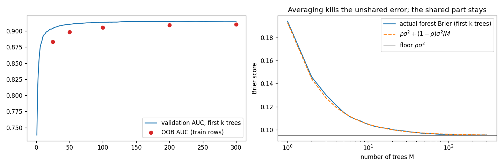
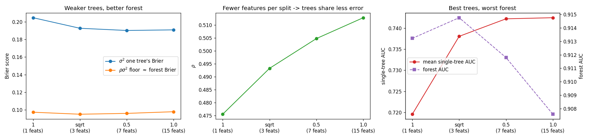

# Random Forest on UCI Adult — where the forest stops improving, and why

> **Random forest on UCI Adult: test AUC 0.918, Brier 0.093, accuracy 0.867.**
>
> Error decomposition shows $\rho \approx 0.83$ — four fifths of a single tree's error is shared
> across the ensemble. The variance term $(1-\rho)\sigma^2/M$ was exhausted by ~100 trees, so the
> remaining error is shared *bias*, which bagging cannot reduce. The predicted floor
> $\rho\sigma^2 = 0.0928$ matched the test Brier of 0.0932.
>
> **This is why boosting is the next step rather than more forest tuning: sequential residual
> fitting attacks shared bias directly, which independent averaging structurally cannot.**

I measured why the forest plateaued, found the limit was shared bias rather than variance, and that's
structurally the thing boosting addresses.



*Left: validation AUC of the first $k$ trees, with OOB AUC overlaid. Right: the forest's actual Brier
score against the predicted curve $\rho\sigma^2 + (1-\rho)\sigma^2/M$. The two are indistinguishable,
and both land on the floor — the grey line — by ~100 trees.*

---

## Headline numbers

| | value |
|---|---|
| test AUC | 0.9182 |
| test Brier | 0.0932 |
| test accuracy | 0.8671 |
| >50K precision / recall | 0.784 / 0.615 |
| predicted floor $\rho\sigma^2$ (from validation) | 0.0928 |
| shipped threshold | 0.5 |

Shipped model: `models/rf_adult_v2.joblib` — `RandomForestClassifier(n_estimators=200,
max_features="sqrt", min_samples_leaf=5)` on 13 features.

## The method: splitting the error in two

The whole analysis runs on one identity. Stack every tree's predicted probability into
$P \in \mathbb{R}^{M \times n}$, let $E = P - y$, and form the Gram matrix $G = EE^\top / n$. Then

$$\text{Brier}_{\text{forest}} = \rho\sigma^2 + \frac{(1-\rho)\sigma^2}{M}$$

where $\sigma^2 = \mathrm{tr}(G)/M$ is one tree's average Brier and $\rho$ is the mean
off-diagonal correlation — the fraction of a tree's error that every other tree also makes.
`error_decomposition` asserts this identity holds on every fit, so it is checked rather than assumed.

$G$ has $M$ diagonal entries and $M^2 - M$ off-diagonal ones. At $M=300$ that's 300 versus 89,700 —
the forest's error is overwhelmingly determined by how trees' mistakes *coincide*, not by how bad any
single tree is. The second term is the only one $M$ touches. Once it is small, more trees are free of
charge and worth nothing.

Two reasons this is cheap to compute: `per_tree_proba` stacks all $M$ trees once, and
`cumsum / k` then reconstructs the entire growth history of the forest in a single vectorised pass.
Row $m$ is a snapshot of the model at $M = m$ trees — no refitting, no warm-start loop, because the
trees are i.i.d. and truncating the list at $m$ is a valid forest of that size.

## Data and setup

- `fetch_openml('adult', version=2)` — 48,842 rows, 14 features, 23.9% positive (`>50K`).
- `'?'` in categorical columns is masked to NaN (`workclass` 5.7%, `occupation` 5.8%,
  `native-country` 1.8%); sklearn ≥ 1.4 splits on NaN natively, with a `SimpleImputer` sentinel
  fallback below that.
- `OrdinalEncoder` + cast to float32. No one-hot — trees don't need it, and 41 country levels would
  bloat the split search.
- 60 / 20 / 20 stratified split: 29,304 train / 9,769 val / 9,769 test. Test is touched once, at the
  end.
- A `random_noise` column of pure Gaussian noise is injected as a control for the importance step.

## What was swept, and what it showed

### Number of trees

Both AUC and Brier flatten around $M \approx 100$. The `averaged_away` term $(1-\rho)\sigma^2/M$ is
0.0005 at $M=200$ — about 0.5% of the floor. Averaging is fully exhausted; 300 trees buy nothing over
100.

### `max_features` — weaker trees, better forest

| max_features | feats/split | $\sigma^2$ | $\rho$ | floor | forest AUC | single-tree AUC |
|---|---|---|---|---|---|---|
| 1 | 1 | 0.2046 | 0.4755 | 0.0973 | 0.9132 | 0.7196 |
| **sqrt** | **3** | **0.1926** | **0.4932** | **0.0950** | **0.9148** | 0.7380 |
| 0.5 | 7 | 0.1901 | 0.5048 | 0.0960 | 0.9118 | 0.7422 |
| 1.0 | 15 | 0.1908 | 0.5128 | 0.0979 | 0.9076 | 0.7425 |

The trade is visible in two columns moving opposite ways. $\sigma^2$ falls as features per split rise
— stronger individual trees. $\rho$ rises — trees pick the same dominant splits, so their errors
coincide. Neither column alone has a useful optimum; the product $\rho\sigma^2$ does, and it is
U-shaped with a minimum at `sqrt`.

**Individual tree quality is not ensemble quality.** `single_tree_auc` rises monotonically
0.7196 → 0.7425 while `forest_auc` peaks at `sqrt` and then falls to 0.9076. The best trees build the
worst forest. Tuning on tree strength alone would pick exactly wrong.



*The right panel is the claim in one picture: mean single-tree AUC (solid) climbing while forest AUC
(dashed) peaks at `sqrt` and falls away. The two axes cross in opposite directions.*

Spread across the whole grid is 0.007 AUC, so the honest action is: keep the default and stop
sweeping it.

### `min_samples_leaf` — the only knob that moved the floor

| min_samples_leaf | $\sigma^2$ | $\rho$ | floor | val AUC | leaves/tree |
|---|---|---|---|---|---|
| 1 | 0.1926 | 0.4932 | 0.0950 | 0.9148 | 3948 |
| **5** | **0.1244** | **0.7535** | **0.0937** | **0.9190** | **1163** |
| 20 | 0.1112 | 0.8629 | 0.0959 | 0.9172 | 396 |
| 50 | 0.1112 | 0.8873 | 0.0987 | 0.9145 | 190 |
| 100 | 0.1138 | 0.8922 | 0.1015 | 0.9114 | 105 |

`msl=5` cuts $\sigma^2$ by a third and shrinks trees to a quarter of their leaves for +0.004 AUC.
Past that, $\sigma^2$ stops improving while $\rho$ keeps climbing, so the floor rises.

### Feature importance — the noise column earns its keep

Permutation importance on validation, with MDI alongside:

| feature | MDI | perm (val) | MDI rank | perm rank | n_unique |
|---|---|---|---|---|---|
| capital-gain | 0.1597 | 0.0478 | 2 | 1 | 123 |
| relationship | 0.1646 | 0.0371 | 1 | 2 | 6 |
| education-num | 0.1238 | 0.0282 | 3 | 3 | 16 |
| age | 0.0973 | 0.0242 | 5 | 4 | 74 |
| … | | | | | |
| fnlwgt | 0.0557 | 0.0006 | **7** | **12** | 28,523 |
| random_noise | 0.0533 | 0.0004 | **8** | **15** | 48,842 |

MDI ranks pure noise 8th of 15, above `occupation` and `education`. That is the high-cardinality bias
of impurity importance, caught in the act — and the reason the noise column was injected. Permutation
importance on held-out rows puts it last, where it belongs. `fnlwgt` (a census sampling weight, 28,523
distinct values) sits next to it on both measures.

Dropping both: val AUC 0.9190 → **0.9202**. Two fewer features, slightly better model — `final_v2`.

**The drop moves $\rho$, so every figure above it is stale.** Refitting the same
`sqrt / msl=5` config on 13 features instead of 15:

| | $\sigma^2$ | $\rho$ | floor |
|---|---|---|---|
| 15 features (sweeps above) | 0.1244 | 0.7535 | 0.0937 |
| **13 features (`final_v2`, shipped)** | **0.1124** | **0.8254** | **0.0928** |

$\rho$ going *up* here is not a regression. Trees were spending real impurity budget on
`random_noise` (MDI 0.0533), and every tree splits noise in a different place — that is error which
is uncorrelated by construction, so it inflated the unshared term and held $\rho$ down. Removing it
makes each tree better ($\sigma^2$ falls) and makes the surviving trees agree more ($\rho$ rises).
The product, the only quantity that matters, falls: 0.0937 → **0.0928**.

Reading $\rho$ on its own would call this a loss. It is the same trap as `max_features=1` — the
lowest $\rho$ in the whole sweep, attached to a mediocre forest. From here on, all $\rho$ and floor
figures are the 13-feature ones.

### Threshold — swept, then left at 0.5

`TunedThresholdClassifierCV` does not change the model: it cross-validates on train, collects
out-of-fold probabilities, and picks the cut maximising a scorer. AUC is untouched by construction;
only the operating point moves. The scorer encodes an assumption, so the cost ratio was swept rather
than invented: `net_cost = -(c_fp*FP + c_fn*FN)`.

| c_fn | tau | tau_ideal | precision | recall | accuracy |
|---|---|---|---|---|---|
| 1 | 0.4941 | 0.5000 | 0.777 | 0.627 | 0.868 |
| 2 | 0.3428 | 0.3333 | 0.649 | 0.778 | 0.846 |
| 3 | 0.2924 | 0.2500 | 0.608 | 0.828 | 0.831 |
| 5 | 0.1916 | 0.1667 | 0.531 | 0.915 | 0.787 |
| 10 | 0.1109 | 0.0909 | 0.466 | 0.958 | 0.727 |

Accuracy falls monotonically down the sweep, and that is correct — `c_fn=1` *is* the accuracy
objective, so every row below it trades accuracy for recall deliberately. Judging one row by another
row's metric is the mistake to avoid.

`tau` vs `tau_ideal` is a calibration readout: for honest probabilities the cost-optimal cut is
computable as $\tau^* = 1/(1+c_{fn})$. The gap is ~0 at `c_fn=1`, where most probability mass sits,
and opens to +0.04 in the tail. That gap is the Brier floor surfacing as a decision cost — the reason
`tau` needs empirical tuning rather than derivation.

**Decision: ship at 0.5.** No business cost structure is stated here, so `c_fn=1` is the only
defensible assumption — and the tuner independently confirms it, landing on 0.4941.

### ExtraTrees — the hypothesis that failed

The tuned RF sits at $\rho = 0.83$, and every knob swept so far pushed $\rho$ the *wrong* way.
ExtraTrees attacks it from a direction the others cannot: instead of searching for the best threshold
on each candidate column, it draws thresholds at random, so two trees handed the same column no
longer land on the same cut.

| model | $\sigma^2$ | $\rho$ | floor | single-tree AUC | val AUC |
|---|---|---|---|---|---|
| RF (sqrt, msl=5) | **0.1124** | **0.8254** | **0.0928** | **0.8759** | **0.9202** |
| ET (bootstrap=False) | 0.1151 | 0.8784 | 0.1011 | 0.8735 | 0.9116 |
| ET (bootstrap=True) | 0.1182 | 0.8650 | 0.1023 | 0.8664 | 0.9099 |

$\rho$ went **up**, not down: 0.8254 → 0.8784 / 0.8650. Restoring row sampling recovered almost
nothing, so `bootstrap=False` was not the explanation.

And $\sigma^2$ rose as well, 0.1124 → 0.1151 / 0.1182, with mean single-tree AUC falling 0.8759 →
0.8735 / 0.8664. **ET lost on both terms of the identity simultaneously** — it did not trade tree
quality for diversity, it gave up tree quality *and* got less diversity. Every column in that table
moves against it.

This fits the data, and it explains why both terms moved together. Adult has features with genuinely
sharp thresholds — `capital-gain` is near-deterministic at zero vs nonzero, `education-num` and `age`
have real cutoffs. The RF's exhaustive threshold search finds them. Random cuts miss them, which
makes each tree worse ($\sigma^2$ up), and *every tree misses them in the same way*, which is shared
bias rather than variance ($\rho$ up). One cause, both columns.

Threshold randomisation buys diversity only when the exact split location does not matter much. Here
it does.

$\rho \approx 0.83$ looks intrinsic to this problem rather than an artifact of tuning — which is what
makes the floor a property of the model class, and sends the next step to boosting.

## Test set — the one look

`final_v2` at `tau = 0.5`, evaluated once on the 9,769 held-out rows after every decision above was
settled on validation.

| class | precision | recall | f1 | support |
|---|---|---|---|---|
| `<=50K` | 0.8865 | 0.9466 | 0.9155 | 7,431 |
| `>50K` | 0.7835 | 0.6146 | 0.6889 | 2,338 |
| accuracy | | | **0.8671** | 9,769 |
| macro avg | 0.8350 | 0.7806 | 0.8022 | 9,769 |
| weighted avg | 0.8618 | 0.8671 | 0.8613 | 9,769 |

Confusion matrix:

| | pred `<=50K` | pred `>50K` |
|---|---|---|
| **true `<=50K`** | 7,034 | 397 |
| **true `>50K`** | 901 | 1,437 |

**test AUC 0.9182 · test Brier 0.0932**

Two things to read off this.

The gap between validation (0.9202) and test (0.9182) is 0.002 — no meaningful overfit to the
validation set across the sweeps, which is what the three-way split was for.

**The Brier number is the point of the whole exercise.** The floor predicted from validation was
$\rho\sigma^2 = 0.0928$; the test Brier came in at 0.0932, a gap of 0.0004. The decomposition did not
just describe the forest after the fact — it predicted, from validation alone, the error a
held-out set would produce, and it was right to the fourth decimal. That is what justifies treating
0.093 as a property of this model class on Adult rather than a number this particular run happened to
land on.

The asymmetry in the errors is the class imbalance (23.9% positive) meeting a 0.5 threshold: 901
missed high earners against 397 false alarms. That is the deliberate `c_fn = 1` choice from the
threshold sweep, not an accident — moving it is a one-line change to `threshold` in the artifact.

## Using the saved model

```python
import joblib

a = joblib.load("models/rf_adult_v2.joblib")
proba = a["pipeline"].predict_proba(X[a["features"]])[:, 1]
pred  = (proba >= a["threshold"]).astype(int)
```

The artifact bundles the fitted pipeline, the 13 feature names in order, the threshold, validation
AUC, the chosen hyperparameters, the sklearn version it was fitted under, and a training timestamp.
Raw `df` goes straight in — preprocessing lives inside the pipeline.

## Files

| path | what it is |
|---|---|
| `RF_adultincome.ipynb` | the full analysis, in order |
| `models/rf_adult_v2.joblib` | shipped pipeline + metadata |
| `rf_3_growing_forest.png` | the plot at the top of this page |
| `rf_4_max_features.png` | the `max_features` sweep |

## Requirements

`numpy`, `pandas`, `matplotlib`, `scikit-learn` (≥ 1.4 preferred — NaN splits are native; below that
the pipeline falls back to a `-999.0` sentinel), `joblib`. Everything is seeded with `SEED = 42`.
`fetch_openml` needs network access on first run.
